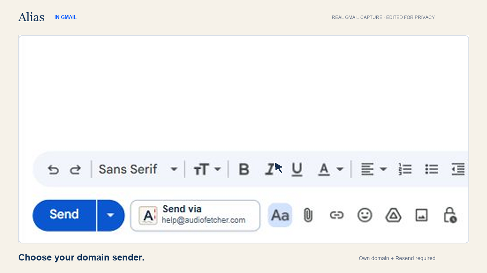
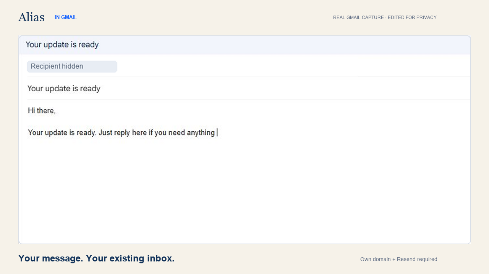
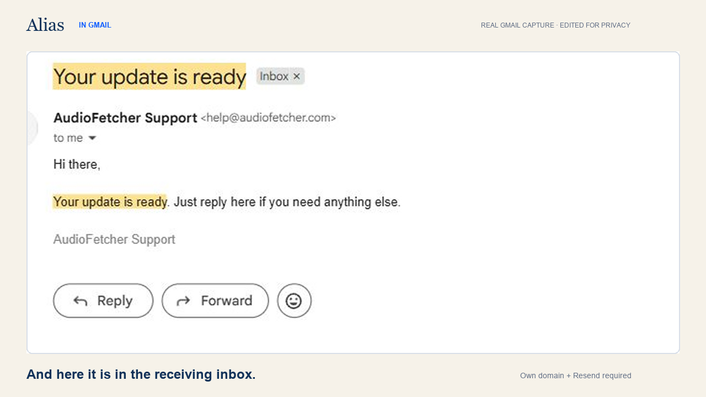

# Alias for Gmail

Send email from your own verified domain while composing in Gmail. Alias adds a separate **Send via alias** button and sends directly through **your own Resend account**, with an experimental Cloudflare adapter.

This is the standalone community source edition. The former Chrome Web Store listing and managed service are discontinued. There is no developer-operated backend, subscription, account registration, analytics, waitlist, or uninstall survey. No AWS or Stripe setup is needed.

## See it in Gmail

[](https://github.com/yazanbaker94/alias-for-gmail/blob/main/docs/media/alias-gmail-demo.mp4)

**[Watch the 27-second Gmail demo](https://github.com/yazanbaker94/alias-for-gmail/blob/main/docs/media/alias-gmail-demo.mp4)** · [Download the MP4](https://raw.githubusercontent.com/yazanbaker94/alias-for-gmail/main/docs/media/alias-gmail-demo.mp4)

Write in Gmail → click **Send via alias** → your connected Resend account sends from your verified domain. Replies follow your existing mailbox or forwarding setup.

| 1. Compose in Gmail | 2. Receive from your domain |
| --- | --- |
|  |  |

These are real Gmail captures from the original release, recorded September 6, 2026. The demo is an edited capture sequence with zooms, cursor emphasis and shortened timing, not an uninterrupted recording. Recipient details are masked. It demonstrates the direct Resend flow, not a fresh live test of this refactored edition. The ending references the former product website; use the local installation steps below instead. See [media notes](docs/media/README.md).

## Install locally

1. Download this repository as a ZIP and extract it (or clone it).
2. Open `chrome://extensions`, enable Developer mode, and choose **Load unpacked**.
3. Select the `extension` directory, not the repository root.
4. Open Alias settings. Add your sender under **Sender**.
5. Under **Delivery**, choose Resend and enter a sending-only API key restricted to your verified domain.
6. Accept the data-use disclosure on **Overview**, save, and refresh Gmail.
7. Compose a test email to an address you control and use **Send via alias**. Verify receipt and reply delivery.

You need a domain verified by your provider and an existing mailbox or forwarding rule to receive replies. Alias does not supply a mailbox or change DNS. Reply-To matches From. Provider charges, sending policies and account limits apply.

## Supported behavior and limits

- Resend sending, replies through existing forwarding, and local attachments were manually tested in the original release. This refactored source edition has automated tests; test your own installation before relying on it.
- Gmail's normal Send button stays unchanged. It does not send through Alias.
- Local attachments must be captured after the extension loads. Gmail capture is limited to 3 MiB total; Drive links are not downloaded as attachments.
- Cloudflare is experimental: arbitrary-recipient sending was not live validated. Check Cloudflare's current Email Sending availability, permissions and paid-plan requirements yourself.
- Provider acceptance is not a guarantee of delivery. Check your provider logs for bounces.
- Gmail changes its DOM frequently; integration can break. This is provided as-is, with no uptime or support guarantee.

## Privacy and security

Only clicking Send via alias sends draft fields to the selected provider. API credentials are stored in Chrome local extension storage (not Chrome Sync); this is not an encrypted password vault. Content scripts receive only the configuration fields needed for the Gmail UI, not provider secrets. Settings enforce trusted-context storage access.

Diagnostics stay local and contain counts, timestamps, error codes and a partially masked sender. They exclude message bodies, complete recipient addresses and API keys. Review diagnostics before posting them publicly. See [PRIVACY.md](PRIVACY.md) and [SECURITY.md](SECURITY.md).

## Development

Use Node.js 22.12+ and run:

```sh
npm ci
npm run check
```

The extension runs directly from `extension/`; no bundler, remote code or deployment is required. Tests use synthetic Gmail fixtures and mocked provider responses, not live email or credentials.

This repository intentionally excludes the retired backend, admin site, private operations notes, production deployment archives, original design exports and private raw demo captures. Only the reviewed public demo exports are included.

## License

MIT for project code. Gmail, Resend, Cloudflare and other provider marks belong to their respective owners and are used for identification only. No affiliation or endorsement is implied.
